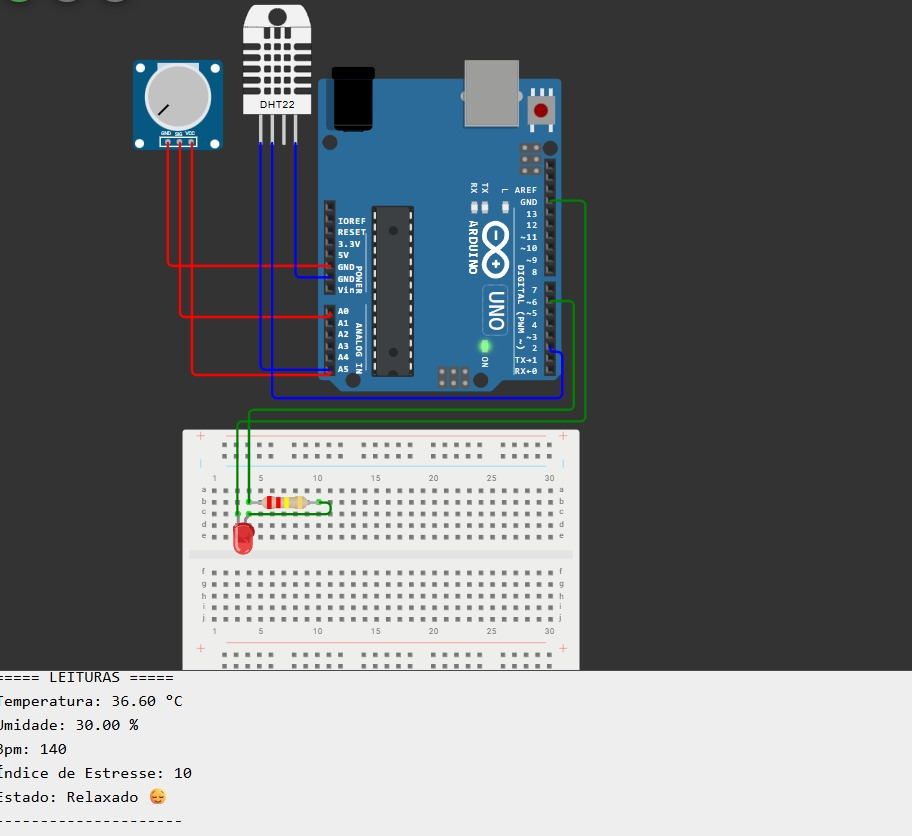

# Smart Mouse: Monitor de Estresse e Bem-Estar
Este projeto é uma solução de hardware (Smart Mouse) projetada para monitorar ativamente os níveis de estresse de profissionais em home office e sugerir intervenções para melhorar o bem-estar e a produtividade.

## O Problema
Profissionais que utilizam do computador enfrentam desafios únicos que frequentemente resultam em níveis elevados de estresse. A dificuldade em separar a vida profissional da pessoal e o possível isolamento contribuem para um desconforto mental e físico contínuo.
Este cenário impacta negativamente não apenas o bem-estar do colaborador, mas também sua capacidade de trabalho, levando diretamente a uma queda na produtividade, menor disposição para executar tarefas e uma diminuição geral no desempenho. A ausência de ferramentas que identifiquem esses picos de estresse em tempo real impede uma intervenção rápida, permitindo que o problema se agrave.

## A Solução
A solução proposta é um Smart Mouse, um dispositivo inteligente projetado para atuar como um assistente de bem-estar no ambiente de trabalho e home office.
Enquanto o profissional realiza suas tarefas diárias, o mouse monitora ativamente seu estado, identificando sinais e padrões associados ao aumento do estresse. Ao detectar um nível de desconforto, o sistema age proativamente e sugere atividades específicas e correlacionadas ao que foi detectado (como pausas para respiração, alongamentos ou outras micro-intervenções). O objetivo é fornecer ajuda imediata para aliviar o desconforto, melhorando a disposição e o foco do colaborador.

## Instruções de Uso
1. Montagem: Siga a foto em [Imagens do Circuito](arduinoUno.jpeg) para conectar os sensores ao microcontrolador.
2. Software: Faça o upload do código-fonte (arquivo `.ino`) para a placa Arduino uno usando a IDE Arduino.
3. Dependências: Certifique-se de ter todas as [Dependências](DHT sensor library) instaladas na sua IDE.
4. Execução: Conecte o dispositivo ao computador. O mouse funcionará normalmente enquanto coleta dados.
5. Visualização: Abra o Monitor Serial ou o software desktop para receber as sugestões de atividades. 

## Dependências
Hardware
* [Nome do Microcontrolador, Arduino Uno]
* [Nome do Sensor 1 Sensor de Temperatura e Umidade DHTT]
* [Componentes de um mouse óptico]
* [Fios, jumpers, protoboard, sensor e potenciometro]

## Software
* IDE Arduino: Wokiwi
* [Biblioteca para Sensor, DHT sensor library]

## Imagens do Circuito

## Link do Wokwi
Visualize e simule o circuito em tempo real no Wokwi | ([https://wokwi.com/projects/448019460121132033])